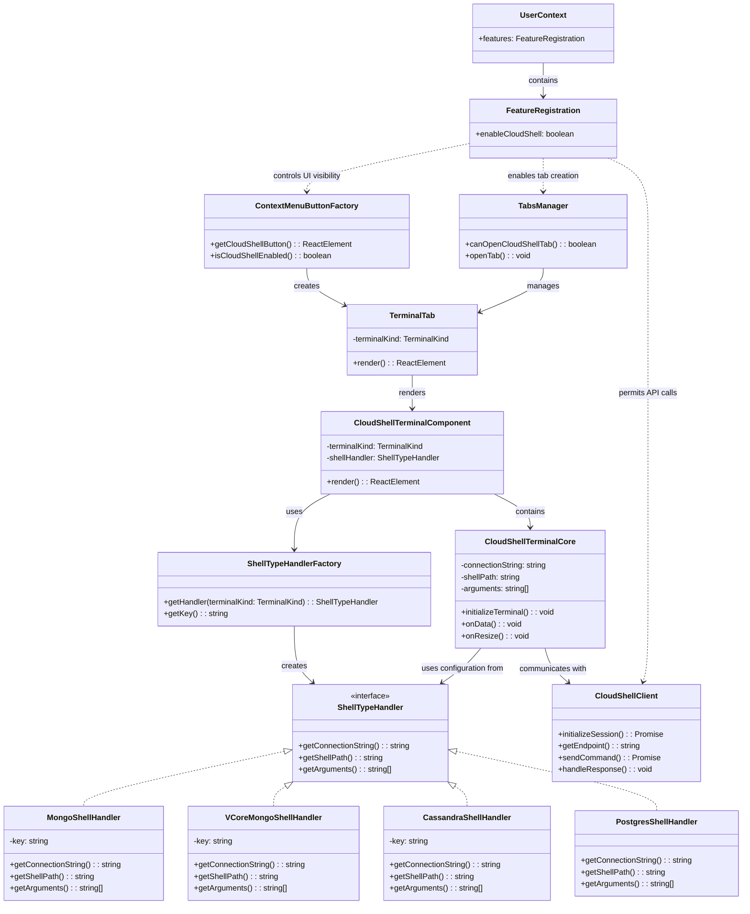
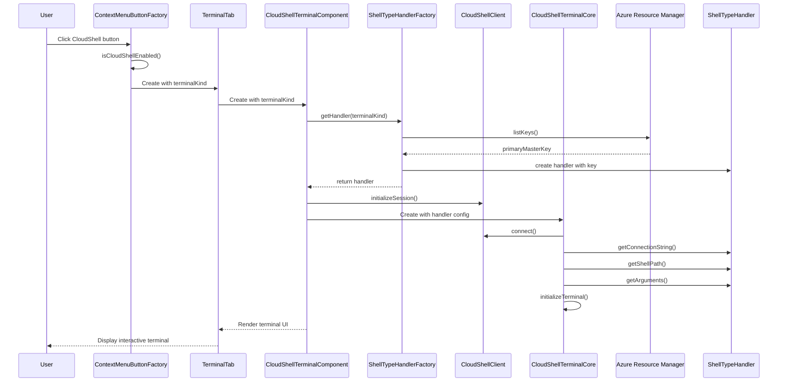

# Cloud Shell Component Design

## Overview
Cloud Shell provides an integrated terminal experience directly within Cosmos Explorer, allowing users to interact with different database engines using their native command-line interfaces.

## Component Architecture



## Sequence Flow

### Shell Initialization Flow



## Feature Flag

The CloudShell functionality is controlled by the feature flag `userContext.features.enableCloudShell`. When this flag is **enabled** (set to true), the following occurs in the application:

1. **UI Components Become Available:**
   - CloudShell buttons appear in the command bar and context menus
   - Terminal options appear in database-specific menus
   - Tab options for opening CloudShell terminals are enabled

2. **Service Capabilities Are Activated:**
   - Backend API calls to CloudShell services are permitted
   - Terminal connection endpoints become accessible
   - Authentication flows for shell access are enabled

3. **Database-Specific Features Are Unlocked:**
   - Terminal experiences tailored to each database type become available
   - Shell handlers are instantiated based on the database type
   - Connection strings are generated and sent to the appropriate shells

4. **Telemetry Collection Begins:**
   - Usage data for CloudShell features is collected
   - Performance metrics for shell operations are tracked
   - Error reporting for shell connections is enabled

The feature is conditionally enabled based on:

- Database account type compatibility (MongoDB, Cassandra, PostgreSQL)
- Cloud environment (not available in sovereign clouds)
- Service availability in the current region
- Account capabilities and permissions

When disabled, all CloudShell functionality is hidden and inaccessible, ensuring a consistent user experience regardless of the feature's state.

## Supported Shell Types

| Terminal Kind | Handler Class | Description |
|---------------|--------------|-------------|
| Mongo | MongoShellHandler | Handles MongoDB shell connections |
| VCoreMongo | VCoreMongoShellHandler | Specialized handler for VCore MongoDB instances |
| Cassandra | CassandraShellHandler | Handles Cassandra shell connections |
| Postgres | PostgresShellHandler | Handles PostgreSQL shell connections |

## Implementation Details

The CloudShell implementation uses the Factory pattern to create appropriate shell handlers based on the database type. Each handler implements the common interface but provides specialized behavior for connecting to different database engines.

### Key Components

1. **ShellTypeHandlerFactory**: Creates the appropriate handler based on terminal kind
   - Retrieves authentication keys from Azure Resource Manager
   - Instantiates specialized handlers with configuration

2. **ShellTypeHandler Interface**: Defines the contract for all shell handlers
   - `getConnectionString()`: Provides the database connection string
   - `getShellPath()`: Returns the path to the shell executable
   - `getArguments()`: Provides command-line arguments for the shell

3. **Specialized Handlers**: Implement specific connection logic for each database type
   - Handle authentication differences
   - Provide appropriate shell arguments
   - Format connection strings correctly

4. **CloudShellTerminalComponent**: React component that renders the terminal interface
   - Receives the terminal type as a property
   - Uses ShellTypeHandlerFactory to get the appropriate handler
   - Renders the CloudShellTerminalCore with the handler's configuration
   - Manages component lifecycle and state

5. **CloudShellTerminalCore**: Core terminal implementation
   - Handles low-level terminal operations
   - Uses the configuration from ShellTypeHandler to initialize the terminal
   - Manages input/output streams between the user interface and the shell process
   - Handles terminal events (resize, data, etc.)
   - Implements terminal UI and styling

6. **CloudShellClient**: Client for interacting with CloudShell backend services
   - Initializes the terminal session with backend services
   - Manages communication between the terminal UI and the backend shell process
   - Handles authentication and security for the terminal session
   - Provides error handling and reconnection logic

7. **ContextMenuButtonFactory**: Creates CloudShell UI entry points
   - Checks if CloudShell is enabled via `userContext.features.enableCloudShell`
   - Generates appropriate terminal buttons based on database type
   - Handles conditional rendering of CloudShell options

8. **TerminalTab**: Container component for terminal experiences
   - Renders appropriate terminal type based on the selected database
   - Manages terminal tab state and lifecycle
   - Provides the integration point between the terminal and the rest of the Cosmos Explorer UI

## Telemetry Collection

CloudShell components utilize `TelemetryProcessor.trace` to collect usage data and diagnostics information that help improve the service and troubleshoot issues.

### Telemetry Events

| Event Name | Description | Collected Data |
|------------|------------|----------------|
| CloudShellInitiated | Triggered when user starts a CloudShell session | Terminal type, database account type, success/failure |
| CloudShellCommandExecuted | Triggered when a command is executed | Command type (not the actual command text), execution time, success/failure |
| CloudShellConnectionFailed | Triggered when connection fails | Error type, terminal type, failure reason |
| CloudShellSessionDuration | Triggered when session ends | Session duration, terminal type, commands executed count |
| CloudShellFeatureUsage | Triggered when specific features are used | Feature name, usage count |

### Real-time Use Cases

1. **Performance Monitoring**:
   - Track shell initialization times across different regions and database types
   - Identify performance bottlenecks in specific shell operations
   - Monitor command execution latency

2. **Error Detection and Resolution**:
   - Detect increased error rates in real-time
   - Identify patterns in connection failures
   - Trigger alerts when error thresholds are exceeded
   - Correlate errors with specific client configurations

3. **Feature Adoption Analysis**:
   - Measure adoption rates of different terminal types
   - Track which CloudShell capabilities are most frequently used
   - Identify user workflows and common command patterns
   - Inform feature prioritization decisions

4. **User Experience Optimization**:
   - Analyze session duration to understand engagement
   - Identify abandoned sessions and potential pain points
   - Measure the impact of new features on usage patterns
   - Track command completion rates and error recovery

### Implementation Example

```typescript
// Example of telemetry collection in CloudShell components
private initializeShellSession(terminalKind: TerminalKind): void {
  const startTime = Date.now();
  
  try {
    // Shell initialization logic
    this.shellHandler = await ShellTypeHandlerFactory.getHandler(terminalKind);
    const success = true;
    
    TelemetryProcessor.trace({
      eventName: "CloudShellInitiated",
      properties: {
        terminalKind: terminalKind,
        databaseType: userContext.databaseAccount.kind,
        success: String(success),
        durationMs: String(Date.now() - startTime)
      },
      measurements: {
        durationMs: Date.now() - startTime
      }
    });
  } catch (error) {
    TelemetryProcessor.trace({
      eventName: "CloudShellConnectionFailed",
      properties: {
        terminalKind: terminalKind,
        errorType: error.name,
        errorMessage: error.message,
        success: "false"
      }
    });
    throw error;
  }
}
```

### Data Privacy

The telemetry system is designed with privacy in mind:
- No actual command text or queries are collected
- No connection strings or credentials are logged
- No personally identifiable information is captured
- Telemetry complies with data residency requirements

## Limitations and Regional Availability

### Network Isolation

Network isolation (such as private endpoints, service endpoints, and VNet integration) is not currently supported for CloudShell connections. All connections to database instances through CloudShell require the database to be accessible through public endpoints.

Key limitations:
- Cannot connect to databases with public network access disabled
- No support for private link resources
- No integration with Azure Virtual Networks
- IP-based firewall rules must include CloudShell service IPs

### Data Residency

Data residency requirements may not be fully satisfied when using CloudShell due to limited regional availability. CloudShell services are currently available in the following regions:

| Geography | Regions |
|-----------|---------|
| Americas | East US, West US 2, South Central US, West Central US |
| Europe | West Europe, North Europe |
| Asia Pacific | Southeast Asia, Japan East, Australia East |
| Middle East | UAE North |

**Note:** For up-to-date supported regions, refer to the region configuration in:
`src/Explorer/CloudShell/Configuration/RegionConfig.ts`

### Implications for Compliance

Organizations with strict data residency or network isolation requirements should be aware of these limitations:

1. Data may transit through regions different from the database region
2. Terminal session data is processed in CloudShell regions, not necessarily the database region
3. Commands and queries are executed through CloudShell services, not directly against the database
4. Connection strings contain database endpoints and are processed by CloudShell services

These limitations are important considerations for workloads with specific compliance or regulatory requirements.
